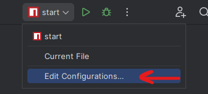
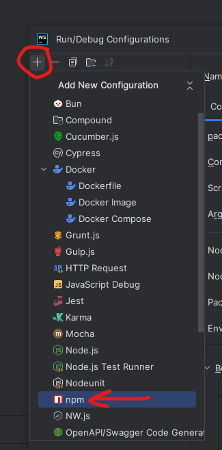
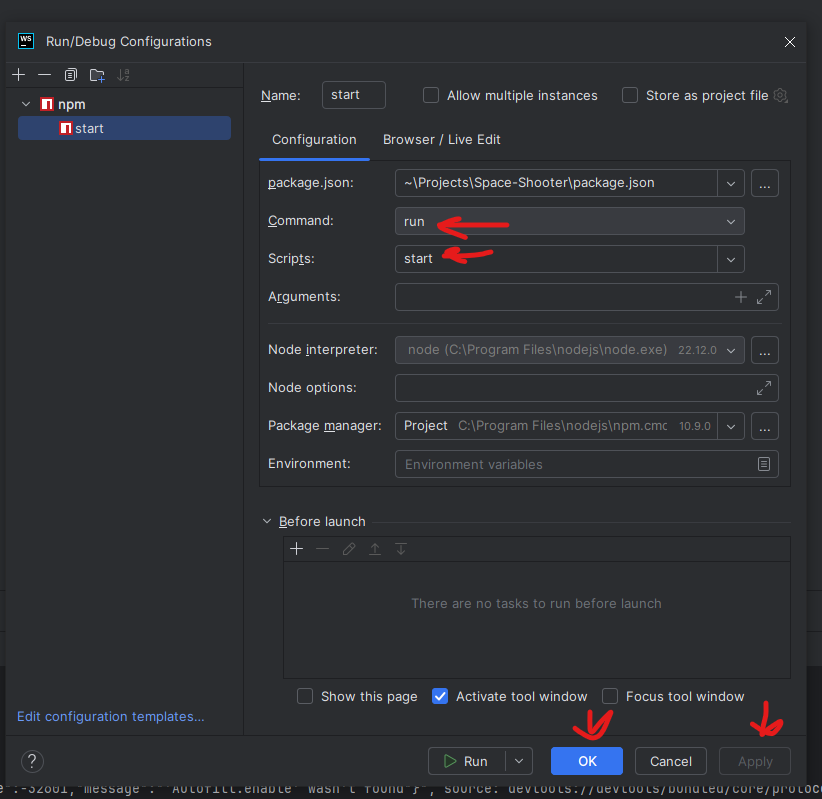

# Space-Shooter

# Installation Guide

## 1. Install Node.js

First, make sure Node.js (which includes npm) is installed on your system.

- Download and install the latest LTS version from: https://nodejs.org/

To verify the installation, run:

```
node -v
npm -v
```

## 2. Install Dependencies

Navigate to the project directory in your terminal, then run:

```
npm install
```


This will install all necessary packages listed in `package.json`.

## 3. Setup Steps

Follow the steps illustrated in the images:

- Step 1: 
- Step 2: 
- Step 3: 

Make sure to complete each step in order before proceeding.

---

After these steps, the project should be ready to run.
